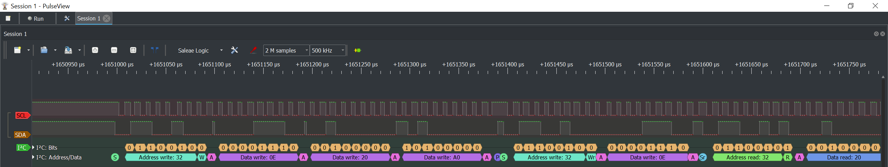

check Epson RX-8025T
===

**RX-8025T not equal RX-8025SA/NB**

the repositry for me verify RTC RX-8025T with STM32F103RC

use GPIO to simualtion an I2C master (only Open Drian mode with external pull up resistor)

the code verify passed now

### Result Logic Analyzer

### Docs
1. [RX-8025T Application Manaual (English)](Docs/RX-8025T%20Application%20Manual.pdf)
1. [RX-8025T 使用说明概要(Simplified Chinese)](Docs/EPSON-RX8025T.pdf)

--------------

### Hardward configuration of board

* MCU: STM32F103RC
* SWD: enabled for download and debugging
* UART1: GPIOA.9/GPIOA.10 for debug message output
* HSE: Crystal/8 MHz and to configuration SYSCLK to 72MHz
* RTC(RX8025T): connect with GPIOB.13(SDA)/GPIOB.14(SCL) with external pull up resistors(10KOhm)
* LED: GPIOB.0(LED1) and GPIOC.5(LED2)
